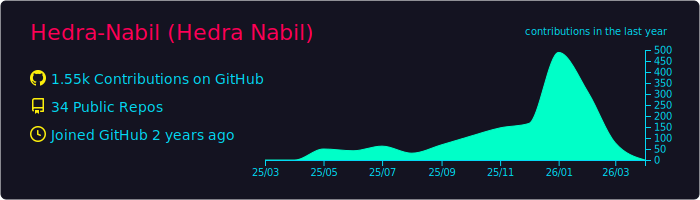
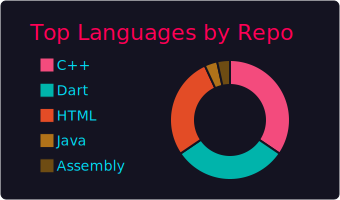

# 👋 Welcome to My Digital Workspace

  

---

## 👨‍💻 About Me 

> **Software Engineer | Mobile Specialist | AI-Powered Solutions**

I'm **Hedra Nabil**, a dedicated software engineer specialized in building scalable, high-performance mobile applications using **Flutter**. I combine my expertise in mobile development with a strong foundation in **Artificial Intelligence** and **DevOps** to create complete, robust technical solutions.

**🚀 Current Focus & Projects:**
- 🚚 **"Al-Naqla" (النقلة):** Developing a comprehensive logistics & fleet management SaaS platform using Flutter for mobile/web and Docker for deployment.
- 🗣️ **"s2s" (Speech-to-Sign):** Creating an accessibility app that integrates AI models with a mobile UI to bridge communication gaps.

**🏆 Certifications:**
- **Huawei HCIA-AI V4.0** Certified.

---

## 🛠 Technical Arsenal

| 📱 Flutter & Mobile Core | ⚙️ Backend & DevOps | 🤖 AI & Data Science |
| :---: | :---: | :---: |
|  |  |  |

| 🗄️ Databases | 🏗️ Architecture & Tools | 🌐 Networking Concepts |
| :---: | :---: | :---: |
|  | **Clean Architecture, BLoC/Cubit**  | **CCNA Knowledge** *(VLAN, Subnetting, DNS)* |

---

## 🧩 Flutter Expertise Highlights

| 🏗️ State Management | 🔌 API & Integration | 🚀 Performance Optimization |
| :---: | :---: | :---: |
| **BLoC / Cubit Library** *(Scalable & Testable)* | **RESTful APIs (Dio)** **Google Maps & Location Services** | **Lazy Loading & Pagination** **Isolates for Heavy Tasks** |

  <b>📫 Let's Connect:</b> Open to technical collaborations on challenging mobile and AI projects.

---
## 🏆 Achievements & Stats

  

 

<table>
  <tr>
    <td align="center">
      
    </td>
    <td align="center">
      
    </td>
  </tr>
  <tr>
    <td align="center" colspan="2">
       
    </td>
  </tr>
</table>

---

## 🔥 Contribution Heatmap

  

---

## 🎯 Featured Projects

| 📱 BMI Calculator | 🎬 Movie Discovery | ✅ Task Management |
| :---: | :---: | :---: |
|  |  |  |

---

## 📊 Social Proof

 

---

## 🐍 Snake Animation

  <picture>
    <source media="(prefers-color-scheme: dark)" srcset="https://raw.githubusercontent.com/Hedra-Nabil/Hedra-Nabil/output/snake-dark.svg" />
    <source media="(prefers-color-scheme: light)" srcset="https://raw.githubusercontent.com/Hedra-Nabil/Hedra-Nabil/output/snake-light.svg" />
    
  </picture>

---

## 📬 Let's Connect

  

### 💫 *"Great software is built by passionate developers who never stop learning"*

