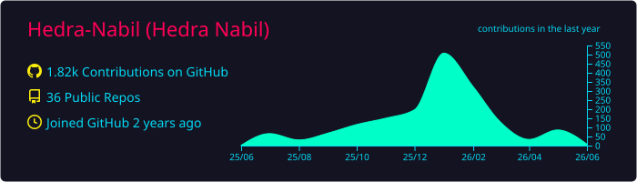
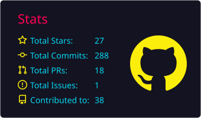
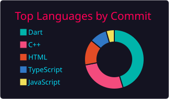

# 👋 Hi, I'm Hedra Nabil

<div align="center">


<br/>

<a href="https://www.linkedin.com/in/hedra-nabil-6043221a4/">
  
</a>

<a href="mailto:hedranabil614@gmail.com">
  
</a>

<a href="https://wa.me/201064456538">
  
</a>


</div>

---

# 🚀 About Me

```dart
class HedraNabil extends SoftwareEngineer {
  final String location = "Egypt 🇪🇬";

  final List<String> focus = [
    "Mobile Engineering",
    "Backend Systems",
    "DevOps & Infrastructure",
    "AI Integrations",
    "Scalable Architecture",
  ];

  final String philosophy =
      "Build simple. Design for scale. Automate everything possible.";

  @override
  void solveProblem() {
    while (problem.exists) {
      understand();
      design();
      build();
      test();
      improve();
    }
  }
}
```

I'm a **Software Engineer** with a strong background in **Flutter and cross-platform mobile development**, currently expanding deeper into **backend engineering, distributed systems, DevOps, infrastructure and AI-powered automation**.

I enjoy working on systems where multiple disciplines meet:

- 📱 Mobile applications
- ⚙️ Backend APIs
- 🧠 AI-powered workflows
- 🐳 Containerized infrastructure
- 🚀 CI/CD & deployment
- 🗄️ Databases & caching
- 🌐 Production web systems
- 🔌 Third-party integrations
- 📊 Monitoring & observability

I don't just like building features.

**I like understanding how the entire system works.**

---

# ⚡ What I'm Building

## 🚘 EgyptLimo — Transportation Technology Platform

One of the systems I'm currently working on is **EgyptLimo**, a transportation and airport-transfer platform built around a multi-service architecture.

The ecosystem includes:

```text
                         ┌─────────────────────┐
                         │      Customers      │
                         └──────────┬──────────┘
                                    │
                              Web / Mobile
                                    │
                   ┌────────────────▼──────────────┐
                   │       Application Layer       │
                   │  Next.js • Flutter • APIs     │
                   └────────────────┬──────────────┘
                                    │
                 ┌──────────────────▼─────────────────┐
                 │          Backend Services          │
                 │ Laravel • REST APIs • Integrations │
                 └───────────┬───────────┬────────────┘
                             │           │
                 ┌───────────▼───┐   ┌───▼────────────┐
                 │ Pricing Engine│   │ Ticket Services │
                 └───────────┬───┘   └───┬────────────┘
                             │           │
                 ┌───────────▼───────────▼───────────┐
                 │      MySQL • Redis • Workers      │
                 └────────────────┬──────────────────┘
                                  │
                      Docker • Nginx • Cloudflare
```

### Engineering areas

- Dynamic transportation pricing
- Airport transfer booking
- Payment integration
- Ticketing integrations
- SEO-driven destination pages
- Admin & operations dashboards
- Redis caching
- Background workers
- WebSockets
- Dockerized deployment
- Cloudflare security
- Monitoring
- Infrastructure optimization
- Automation workflows

> Building software is one thing.  
> **Keeping it fast, secure and reliable in production is another.**

---

# 🧠 Engineering Interests

<div align="center">

| 📱 Mobile Engineering | ⚙️ Backend Engineering | ☁️ DevOps & Infrastructure |
|---|---|---|
| Flutter | Laravel | Docker |
| Dart | REST APIs | Nginx |
| BLoC / Cubit | Authentication | Linux |
| Riverpod | Service Architecture | Cloudflare |
| Clean Architecture | Redis | CI/CD |
| Dio | MySQL | Monitoring |
| Firebase | WebSockets | Reverse Proxy |

</div>

<br/>

<div align="center">

| 🤖 AI & Automation | 🗄️ Data | 🌐 Web |
|---|---|---|
| Python | MySQL | Next.js |
| AI APIs | PostgreSQL | React |
| LLM Integrations | MongoDB | SSR / ISR |
| n8n | Redis | PWA |
| TensorFlow | SQLite | SEO Architecture |
| PyTorch | Geospatial Queries | API Integration |

</div>

---

# 🛠️ Technology Stack

<div align="center">

### Languages


### Mobile


### Backend & Web


### Databases & Caching


### DevOps & Infrastructure


### AI & Tools


</div>

---

# 📱 Flutter Engineering

Flutter is where much of my software engineering journey started, and it remains one of my strongest areas.

### Architecture

```text
Presentation
     │
     ▼
State Management
     │
     ▼
Domain Layer
     │
     ▼
Repository
     │
     ▼
Data Sources
     │
     ├── REST APIs
     ├── Local Storage
     ├── Firebase
     └── Platform Services
```

### Experience includes

- Clean Architecture
- BLoC / Cubit
- Riverpod
- Dependency Injection
- REST APIs
- Dio
- Authentication flows
- Pagination
- Caching
- Local persistence
- Google Maps
- Location services
- Background processing
- Isolates
- Responsive UI
- Android release pipelines
- Production debugging

---

# 🏗️ How I Think About Software

I prefer systems that are:

```text
Readable
   ↓
Maintainable
   ↓
Testable
   ↓
Observable
   ↓
Automated
   ↓
Scalable
```

My approach is simple:

> **Don't introduce complexity because it looks impressive.  
> Introduce complexity only when the problem actually requires it.**

That applies to everything from Flutter architecture to backend services and infrastructure.

---

# 🔌 APIs & Integrations

I enjoy connecting systems together.

Some areas I work with include:

```text
REST APIs
   │
   ├── Mobile Apps
   ├── Web Applications
   ├── Payment Providers
   ├── Maps / Geolocation
   ├── Transportation Platforms
   ├── Automation Services
   ├── AI APIs
   └── Internal Microservices
```

A good integration isn't just:

```http
POST /api/v1/something
```

It also needs:

- Authentication
- Retry strategies
- Idempotency
- Error handling
- Logging
- Monitoring
- Rate limiting
- Validation
- Security
- Graceful failure

---

# ☁️ DevOps & Infrastructure

I'm increasingly interested in the infrastructure behind production applications.

```text
                Internet
                    │
                    ▼
              Cloudflare
                    │
                    ▼
                  Nginx
                    │
             ┌──────┴──────┐
             │             │
             ▼             ▼
        Application     Services
             │             │
             └──────┬──────┘
                    ▼
            Redis / Database
                    │
                    ▼
              Monitoring
```

Areas I work with:

- VPS administration
- Ubuntu/Linux
- Docker
- Docker Compose
- Nginx
- Reverse proxies
- SSL
- DNS
- Cloudflare
- WAF rules
- Rate limiting
- Redis
- MySQL
- Deployment workflows
- GitHub Actions
- Server monitoring
- Performance troubleshooting

---

# 🤖 AI & Automation

I'm interested in using AI where it creates **real operational value**, not just adding an AI badge to a product.

Examples:

- AI assistants
- LLM API integrations
- Workflow automation
- Data extraction
- Smart customer support
- Automated monitoring
- AI-assisted development
- Speech processing
- Accessibility applications

I also experiment with **n8n** for building automation pipelines that connect APIs, databases and AI services together.

```text
Trigger
  ↓
Collect Data
  ↓
Process
  ↓
AI / Business Logic
  ↓
Store / Execute
  ↓
Notify
```

---

# 🌟 Featured Projects

## 🔐 SirrVault

### Password Generator & Secure Local Vault

<a href="https://play.google.com/store/apps/details?id=com.sirrvault.app">
  
</a>


<br/><br/>

A privacy-focused application for securely generating and storing passwords directly on the user's device.

### 🔐 Key Features

| Feature | Description |
|---|---|
| 🔑 Password Generator | Generate customizable strong passwords |
| 🔒 Secure Storage | Encrypted local password vault |
| 🛡️ Privacy First | Designed without unnecessary tracking |
| ⚡ Performance | Fast and lightweight experience |
| 📱 Mobile First | Built using Flutter |

---

## 🚚 Al-Naqla — Logistics Platform

A logistics and fleet-management project exploring:

- Fleet operations
- Driver workflows
- Shipment management
- Mobile applications
- Web dashboards
- Containerized services
- Scalable architecture

---

## 🗣️ Speech-to-Sign

Accessibility-focused experimentation combining:

```text
Speech
  ↓
AI Processing
  ↓
Language Interpretation
  ↓
Sign Representation
  ↓
Flutter Interface
```

The goal is to explore how AI and mobile technology can help reduce communication barriers.

---

# 🧪 Other Projects

<div align="center">

<a href="https://github.com/Hedra-Nabil/BMI_App">
  
</a>

<a href="https://github.com/Hedra-Nabil/movie_app">
  
</a>

<a href="https://github.com/Hedra-Nabil/To-Do_App">
  
</a>

</div>

---

# 🏆 Certifications & Training

<div align="center">

| Certification | Issuer | Focus |
|---|---|---|
| 🤖 **Huawei HCIA-AI V4.0** | Huawei ICT Academy – Egypt | Artificial Intelligence · Machine Learning |
| 📱 **Digital Egypt Youth – Mobile App Development** | National Telecommunication Institute (NTI) | Flutter · Mobile Application Development |
| 💡 **Ideation Program – Certificate of Achievement** | Technology Innovation & Entrepreneurship Center (TIEC) | Creative Ideation · Entrepreneurship · Innovation |
| 🌱 **Git & GitHub** | Udemy | Git · GitHub · Team Collaboration · Version Control |
| 🧪 **Agile Testing Strategies** | Udemy | Agile Testing · Testing Strategies · Best Practices |

</div>

<div align="center">


</div>

---

# 📊 GitHub Analytics

<div align="center">


</div>

<br/>

<div align="center">


</div>

---

# 📈 Development Activity

<div align="center">



<br/><br/>

<table>
<tr>
<td align="center" width="50%"></td>
<td align="center" width="50%"></td>
</tr>
</table>

</div>

> These cards are stored inside this profile repository, so this section does not depend on an external activity-graph service.

---

# 🔥 Contribution Activity

<div align="center">


</div>

---

# 🐍 Contributions

<div align="center">

<picture>
  <source
    media="(prefers-color-scheme: dark)"
    srcset="https://raw.githubusercontent.com/Hedra-Nabil/Hedra-Nabil/output/snake-dark.svg"
  />
  <source
    media="(prefers-color-scheme: light)"
    srcset="https://raw.githubusercontent.com/Hedra-Nabil/Hedra-Nabil/output/snake-light.svg"
  />
  
</picture>

</div>

---

# 💡 Current Learning & Exploration

```yaml
currently_exploring:
  architecture:
    - Distributed Systems
    - Microservices
    - Event-Driven Architecture

  infrastructure:
    - Load Balancing
    - High Availability
    - Container Orchestration
    - Kubernetes

  backend:
    - Service Separation
    - Queue Architecture
    - Caching Strategies
    - Database Scaling

  ai:
    - LLM Applications
    - AI Agents
    - Workflow Automation
```

---

# 🎯 Engineering Goals

I'm continuously working toward becoming an engineer capable of taking a product through the entire lifecycle:

```text
Idea
 ↓
Architecture
 ↓
Development
 ↓
Testing
 ↓
Deployment
 ↓
Monitoring
 ↓
Scaling
 ↓
Optimization
```

Not only:

> **"How do I implement this feature?"**

but also:

> **"How will this behave with real users, real traffic and real production failures?"**

---

# 🤝 Let's Build Something

I'm always interested in:

- Interesting software projects
- Mobile applications
- Backend systems
- SaaS platforms
- AI integrations
- Automation
- Infrastructure challenges
- Open-source collaboration

<div align="center">

### 📫 Connect With Me

<a href="mailto:hedranabil614@gmail.com">
  
</a>

<a href="https://wa.me/201064456538">
  
</a>

<a href="https://www.linkedin.com/in/hedra-nabil-6043221a4/">
  
</a>

<br/><br/>

### 💫

**"The best engineers don't just write code.  
They understand the system around it."**

<br/>


</div>
